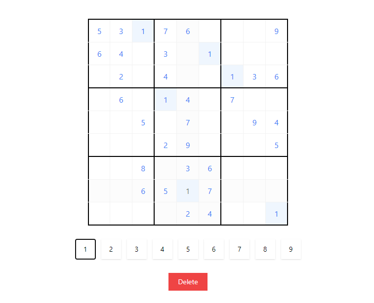

# Sudoku Game

A **Sudoku game** built with **Next.js** and **TypeScript**. This app manages game state and interactions with React hooks (`useState`, `useEffect`), creating a fully interactive Sudoku board that helps players by highlighting cells and checking for errors.



## Features

- **Game Over Detection**: Automatically checks for game completion.
- **Error Detection**: Identifies errors in rows, columns, and 3x3 grids.
- **Highlighting**:
  - **Adjacent Cells**: Highlights cells in the same row, column, or grid as the selected cell.
  - **Matching Values**: Highlights cells with values similar to the selected cell’s value.
- **Responsive and Interactive UI**: Enjoy Sudoku with intuitive and responsive cell selection and highlighting.

## Technologies Used

- **Next.js**: Enables server-side rendering and optimized performance.
- **TypeScript**: Enforces type safety, making the codebase more reliable.
- **React**: Manages UI and game logic using hooks for smooth, dynamic gameplay.

## Installation and Setup

1. **Clone the repository**:

    ```bash
    git clone https://github.com/whispnode/nextjs-sudoku-game.git
    cd sudoku-game
    ```

2. **Install dependencies**:

    ```bash
    npm install
    ```

3. **Run the development server**:

    ```bash
    npm run dev
    ```

4. Open [http://localhost:3000](http://localhost:3000) in your browser to play the game.

## Gameplay Instructions

1. **Objective**: Fill the entire grid with numbers from 1 to 9, ensuring each row, column, and 3x3 grid contains each number exactly once.
2. **Error Detection**: The game will automatically highlight errors in the row, column, or grid if duplicates are detected.
3. **Cell Highlighting**:
   - Selecting a cell will highlight other cells in the same row, column, and grid to make it easier to track potential conflicts.
   - Cells with the same number will also be highlighted to assist with spotting duplicates.
4. **Completion Check**: The game automatically detects completion when all cells are filled without errors.

## Project Structure

- **`components/`**: Contains reusable components like the Sudoku board, individual cells, and error/highlighting indicators.
- **`models/`**: Core logic for Sudoku validation, error checking, and number placement.
- **`game/`**: Next.js pages. The main game interface is in `app/game/page.tsx`.
- **`types/`**: Type definitions for various game elements, ensuring type safety.

## State Management and Hooks

- **`useState`**: Manages the game board state, active cell, error states, and highlights.
- **`useEffect`**: Watches for changes in the board to trigger error checks and detect game completion.

### Example

Here's a simple example of how `useEffect` is used to validate the board whenever a cell is changed:

```typescript
//check errors and game state
    useEffect(() => {
        const updateSudoku = { ...sudoku };
        if (updateSudoku.has_updated) {
            updateSudoku.error_cells = [];
            Logic.checkError.checkRow(updateSudoku);
            Logic.checkError.checkCol(updateSudoku);
            Logic.checkError.checkGrid(updateSudoku);
            Logic.completeGrid(updateSudoku);
            Logic.isComplete(updateSudoku);
            updateSudoku.has_updated = false;
            setSudoku(updateSudoku);
        }
    }, [sudoku]);
```

### Future Improvements

- Difficulty Levels: Add beginner, intermediate, and expert difficulty settings.
- Hints: Offer optional hints to assist players with difficult moves.
- Timer and Scoring: Track time to completion and calculate scores based on speed and accuracy.

### Contributing

Feel free to fork this repository and submit pull requests with enhancements, bug fixes, or feature suggestions. Contributions are welcome!
